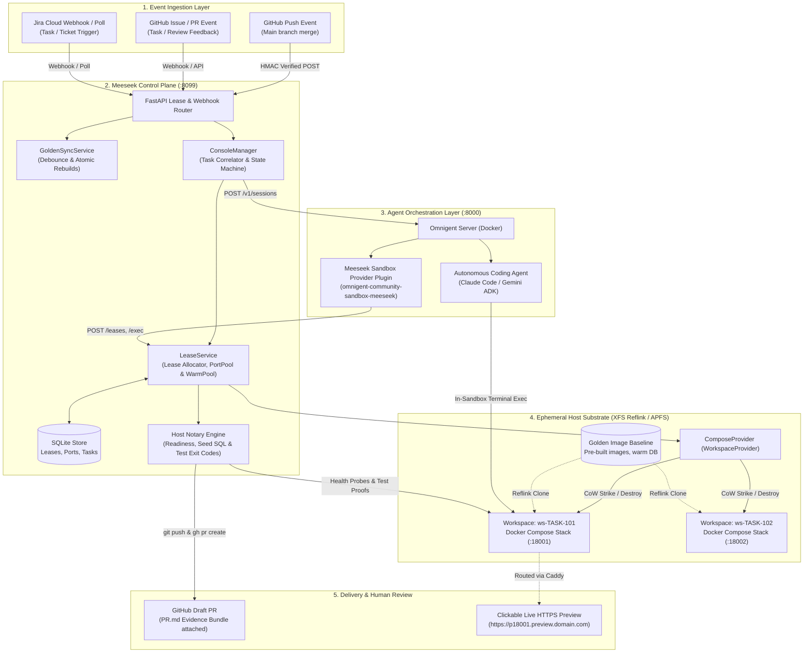
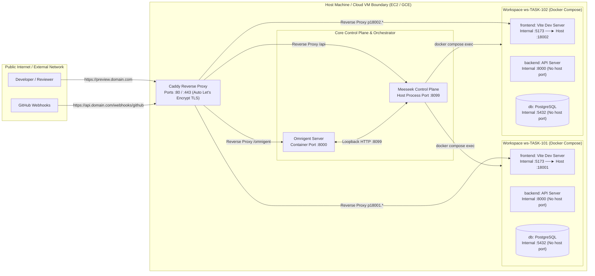
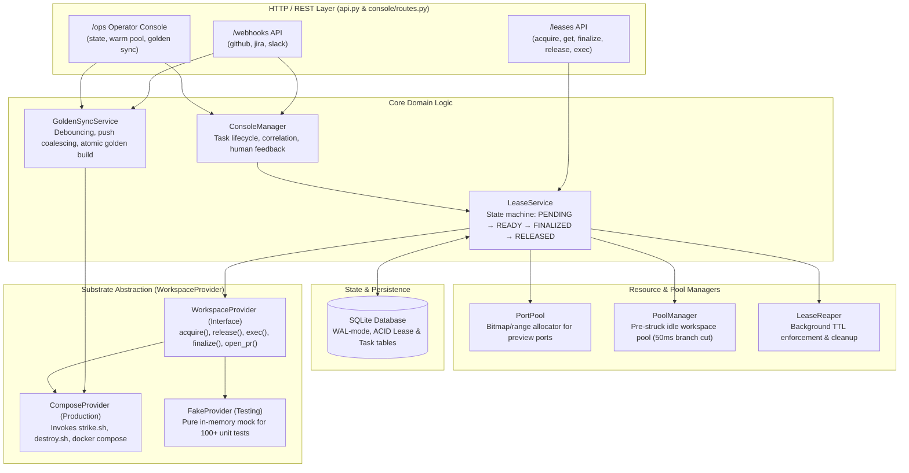

# High-Level Architecture & Design (HLD) 🏗️

Meeseek is built around strict separation of concerns, deterministic isolation, and modular abstractions. This document provides the high-level architectural blueprints, networking topology, and component contracts of the system.

---

## 1. System Context & Actor Topology

The system is governed by a strict division of responsibility across five primary actors:

| Actor | Responsibility | Decides |
|---|---|---|
| **Event Source** (GitHub / Jira / Slack) | Ingests the task specification and developer triggers | *What* needs to be built |
| **Omnigent Agent Runtime** | Orchestrates the LLM reasoning session and tool calls | *Which* agent runs and under what policy |
| **Coding Agent** (Claude Code / Gemini Native) | Analyzes code, writes patches, and exercises the app | *How* to write the code |
| **Meeseek Substrate** | Provisions isolated CoW sandboxes and independently certifies results | *Where* it runs and **proof that it ran** |
| **Human Reviewer** | Interacts via live preview URLs and approves PRs | *Whether* the work is accepted |

### High-Level Architectural Flow Diagram



---

## 2. Network & Port Isolation Architecture

A core technical hurdle in multi-agent sandboxing is preventing **port and networking collisions** on the host machine. If two workspaces run simultaneously, they cannot both bind host port `5432` for PostgreSQL or `5173` for the frontend.

Meeseek solves this with **strict Docker Compose project namespacing**, **automatic internal port stripping**, and **dedicated preview port allocation**:



### Port Stripping Mechanics
- **Compose Override Injection:** When a workspace strikes, Meeseek generates an on-the-fly `compose.ws.yaml` utilizing Compose $\ge 2.24$ YAML merge keys (`ports: !reset []`).
- **Internal Ports Stripped:** Databases, caches, and private APIs are isolated within the workspace's private Docker bridge network (`ws-<id>_default`).
- **Single Preview Exposure:** Only the designated entrypoint service (e.g. `frontend`) is re-exposed on an allocated preview port (`ports: !override ["127.0.0.1:18001:5173"]`).

---

## 3. Control Plane Internal Modular Architecture

The Meeseek Control Plane (`meeseek/control-plane/`) is a high-performance, single-worker FastAPI application designed with clean hexagonal seams:



### The `WorkspaceProvider` Seam
The control plane never makes raw shell calls directly inside HTTP endpoints. All operations invoke the `WorkspaceProvider` interface (`holodeck/providers/base.py`). This guarantees that the control plane can promote from single-host Docker Compose (`ComposeProvider`) to distributed container substrates without altering API routes or orchestration drivers.

---

## 4. Copy-on-Write (CoW) Filesystem Reflink Blueprint

Traditional CI/CD systems clone repositories and rebuild Docker images for every test runner. In contrast, Meeseek uses **OS-level reflink pointers**, achieving near-instant workspace duplication:

```mermaid
flowchart TD
  subgraph PhysicalDisk ["Physical Disk Storage Blocks (XFS reflink=1 / APFS)"]
    BLOCKS_BASE["Shared Physical Disk Blocks<br/>• Checked-out Repos & Dependencies<br/>• Pre-built Docker Image Caches<br/>• Migrated PostgreSQL pgdata Files (100MB–2GB)"]
    BLOCKS_WS1["Delta Blocks (ws-TASK-101)<br/>• Modified src/App.tsx<br/>• New Session Log Files"]
    BLOCKS_WS2["Delta Blocks (ws-TASK-102)<br/>• Modified src/api/routes.py<br/>• Temporary DB Query Rows"]
  end

  subgraph FileSystemView ["Filesystem Directory Tree View"]
    GOLDEN_DIR["Golden Master Directory<br/>/data/golden/full-stack-application/<br/>(Read-Only Reference)"]
    WS1_DIR["Workspace Directory 1<br/>/data/workspaces/ws-task-101/<br/>(Active Agent 1)"]
    WS2_DIR["Workspace Directory 2<br/>/data/workspaces/ws-task-102/<br/>(Active Agent 2)"]
  end

  GOLDEN_DIR ===> BLOCKS_BASE
  WS1_DIR -.->|Reflink (Shared Blocks)| BLOCKS_BASE
  WS1_DIR ===>|Copy-on-Write (Only Changes)| BLOCKS_WS1
  WS2_DIR -.->|Reflink (Shared Blocks)| BLOCKS_BASE
  WS2_DIR ===>|Copy-on-Write (Only Changes)| BLOCKS_WS2
```

### Storage Efficiency & Reflink Performance
- **Time Complexity:** Duplicating a 10 GB golden image directory takes **$<200$ milliseconds** of kernel metadata manipulation (`cp --reflink=always -R golden/ ws-1/`).
- **Disk Allocation:** Zero additional disk blocks are consumed when a workspace is created. Physical disk blocks are only allocated when the agent writes to code files or the database logs new WAL records.
- **Fail-Safe Integrity:** Standard `ext4` filesystems do not support reflinks. The Meeseek startup scripts actively verify `reflink` capability at boot and fail fast if a non-CoW volume is detected.

