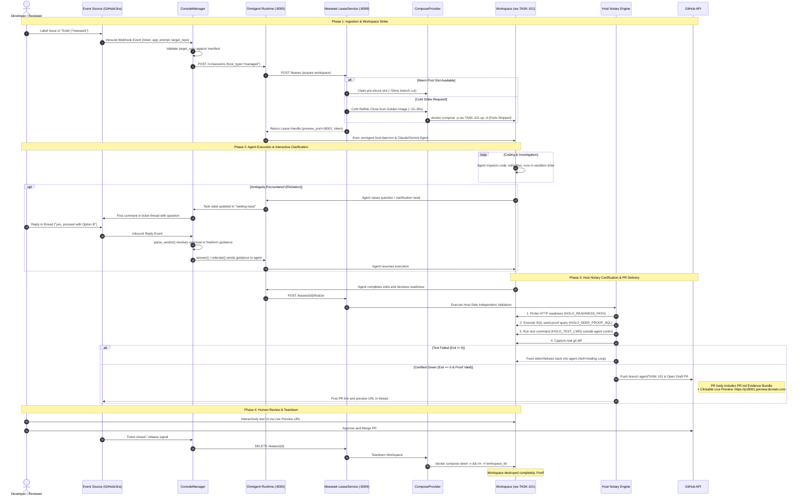
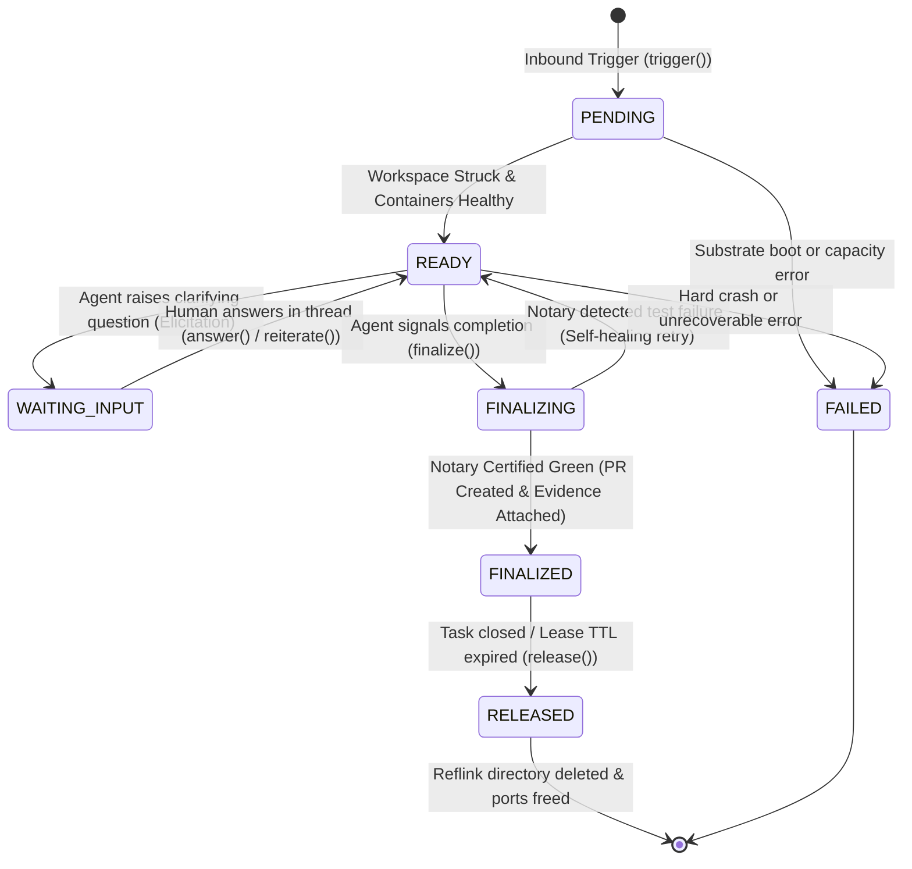

# Workflow Lifecycle: End-to-End Task Journey 🔄

This document traces the complete lifecycle of tasks and environments through Meeseek, derived directly from the control-plane source code (`holodeck/console/manager.py`, `holodeck/api.py`, `holodeck/golden_sync.py`, and `holodeck/service.py`).

---

## 1. Golden Build vs. Strike (Two Critical Cadences)

A fundamental design aspect of Meeseek is separating background environment baking from per-task workspace provisioning:

| Dimension | Golden Build Lifecycle | Task Strike Lifecycle |
|---|---|---|
| **Trigger** | GitHub `push` to main branch / Scheduled cron / Manual `/ops/golden/rebuild` | GitHub Issue label / Jira ticket webhook / API `POST /leases` |
| **Frequency** | Infrequent (nightly or on merged PRs) | Frequent (on every task or bug report) |
| **Operations** | `git clone` from scratch, full image builds, database migrations, offline seed execution | Copy-on-Write (`reflink`) clone of the golden tree, git branch cut, container boot |
| **Execution Time** | Minutes (3–10 minutes depending on stack depth) | **~12–30 seconds** (cold strike) / **~50 milliseconds** (warm pool claim) |
| **Disk Impact** | Creates the durable base snapshot at `$HOLO_GOLDEN` | Ephemeral delta blocks only; completely deleted upon task completion |

---

## 2. End-to-End Sequence Diagram

The following sequence diagram details the full progression of a task, including the interactive clarification loop and host-side Notary certification:



---

## 3. The State Machine & Task Lifecycle

The `ConsoleManager` and `LeaseService` maintain strict, synchronized state transitions:



### State Definitions
- **`PENDING` / `provisioning`**: Workspace is being claimed from the warm pool or cloned via CoW reflink. Docker containers are booting and health-checks are pending.
- **`READY`**: Workspace containers are healthy and answering HTTP readiness probes. The agent process is active and running commands inside the sandbox.
- **`WAITING-INPUT`**: The agent has paused execution because requirements or edge-cases were ambiguous. An elicitation question has been forwarded to the human developer.
- **`FINALIZING`**: The host-side Notary is actively probing the workspace, executing seed-verification queries, and re-running test suites.
- **`FINALIZED`**: All tests passed with authentic exit code `0`, seed rows were verified, a draft pull request was opened on GitHub with evidence attached, and the live preview URL was published.
- **`RELEASED`**: Containers have been halted, networks deleted, and the CoW disk directory removed.

---

## 4. Background Golden Sync Lifecycle

In addition to per-task execution, Meeseek manages automated background golden image synchronization via `holodeck/golden_sync.py`:

```
GitHub Push to main
       │
       ▼  POST /webhooks/github (HMAC SHA-256 verified)
┌────────────────────────────────────────────────────────┐
│  GoldenSyncService (Debounce & Coalescing Engine)      │
│  • Pushes arriving within 30s debounce window coalesce │
│  • Prevents overlapping expensive golden builds       │
└────────────────────────────────────────────────────────┘
       │
       ▼  Trigger atomic golden-build.sh in background
┌────────────────────────────────────────────────────────┐
│  Atomic Staging Directory                              │
│  1. Fresh git clone of all composite repos             │
│  2. Build updated container images                     │
│  3. Run Alembic/Prisma migrations                      │
│  4. Seed database fixtures                             │
│  5. Validate readiness endpoint                        │
└────────────────────────────────────────────────────────┘
       │
       ▼  Atomic Directory Swap
┌────────────────────────────────────────────────────────┐
│  Golden Master Active ($HOLO_GOLDEN)                   │
│  • Sub-second atomic rename replaces old golden image   │
│  • PoolManager discards stale warm slots and strikes    │
│    new warm slots from the updated golden image        │
└────────────────────────────────────────────────────────┘
```

