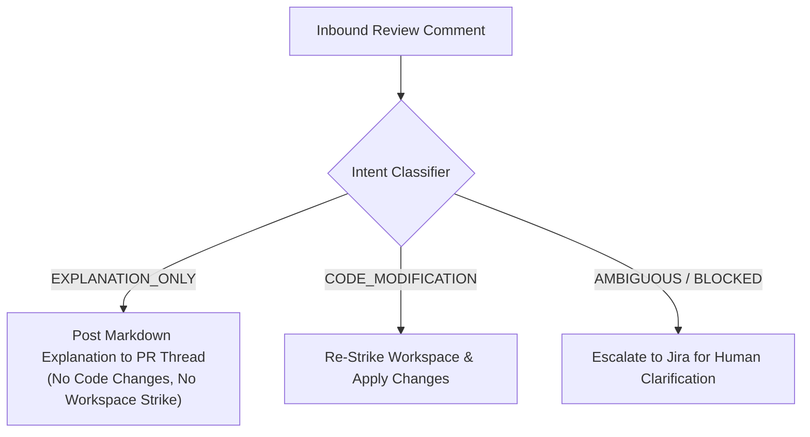

# CI Failure Remediation & PR Review Comment Loop Architecture 🔄

> *"I'm Mr. Meeseeks, look at me! When the pipeline goes red or reviewers want changes, we fix it and verify it!"*

---

## 1. Executive Summary & Problem Statement

Opening a verified Pull Request is not the end of the software engineering lifecycle. In real-world enterprise environments:
1. **Remote CI Failures**: Even after Meeseek's Host Notary certifies Exit 0 inside the local sandbox, external CI pipelines (GitHub Actions, CircleCI, SonarQube, security scanners, multi-repo end-to-end suites) can fail due to environment differences, strict branch lint rules, or flaky integration tests.
2. **Human Code Review Iterations**: Senior engineers and reviewers leave feedback, ask clarifying questions, and request architectural adjustments on the opened PR.

This document details the architectural blueprints for:
* **The CI Failure Remediation Gate**: Ingesting remote CI pipeline failure webhooks, updating task states, and empowering developers to re-engage the agent with full traceback context.
* **Production RFC: PR Review Comment Loops**: An enterprise RFC addressing review batching, intent classification, and ephemeral re-striking.

---

## 2. CI Failure Remediation Gate

```
┌─────────────────────────────────────────────────────────────────────────────────────────────┐
│                                   CI REMEDIATION FLOW                                       │
└─────────────────────────────────────────────────────────────────────────────────────────────┘

    GitHub Actions / CI                      Meeseek Control Plane                       Jira / Human
            │                                         │                                        │
            │  1. check_run (conclusion: failure)     │                                        │
            ├────────────────────────────────────────►│                                        │
            │                                         │ 2. Match branch (agent/<lease_id>)     │
            │                                         │    Update state: CI_FAILED             │
            │                                         │                                        │
            │                                         │ 3. Post Failure Alert Card             │
            │                                         ├───────────────────────────────────────►│
            │                                         │                                        │
            │                                         │ 4. Human replies: #meeseek retry       │
            │                                         │◄───────────────────────────────────────┤
            │                                         │                                        │
            │                                         │ 5. Inject CI logs into sandbox agent   │
            │                                         │    Agent fixes bug & re-tests (Exit 0) │
            │                                         │                                        │
            │                                         │ 6. Notary certifies & pushes to PR     │
            │◄────────────────────────────────────────┤                                        │
            │                                         │                                        │
            │ 7. CI re-runs & passes (Exit 0)         │ 8. PR marked GREEN                     │
            ├────────────────────────────────────────►├───────────────────────────────────────►│
```

### 2.1 Webhook Ingestion & Branch Correlation
* **Endpoint**: `POST /webhooks/github` (or dedicated CI webhook endpoint).
* **Supported Events**:
  * `check_run` (`action: completed`, `conclusion: failure | timed_out | cancelled`).
  * `workflow_run` (`action: completed`, `conclusion: failure`).
* **Correlation Strategy**:
  * Every Meeseek lease runs on a dedicated branch formatted as `agent/<lease_id>` (e.g. `agent/holo-crlt-100`).
  * When a webhook arrives, `head_branch` is extracted and matched against `console_tasks.lease_id` or `console_tasks.ticket`.
  * The task's `workflow_state` is transitioned to `CI_FAILED` in SQLite, recording:
    * `ci_failure_check`: Name of the failed job or workflow (e.g. `backend-lint` or `pytest-matrix`).
    * `ci_failure_summary`: Extracted error message or log excerpt.
    * `ci_failure_url`: Deep link to the GitHub Actions run.

### 2.2 Jira Failure Notification Card
Meeseek immediately alerts the ticket thread with a structured notification card:

```markdown
⚠️ **Meeseek CI Alert: Remote Pipeline Failed**

GitHub Actions reported a build/test failure on PR #{pr_number} (branch `{branch}`).

• **Failed Check**: `{check_name}`
• **Status**: `Failure ❌`
• **Run URL**: [{run_url}]({run_url})

**Error Traceback**:
```text
{log_excerpt_last_1000_chars}
```

🛠️ **Self-Healing Remediation**:
Reply `#meeseek retry` (or `#meeseek retry <guidance>`) to re-engage Meeseek in the sandbox with these CI logs and push a fix commit.
```

### 2.3 Agent Re-engagement & Fix Execution
1. **Developer Trigger**: The developer replies `#meeseek retry` or `#meeseek retry fix the missing typing import`.
2. **Context Injection**: The bridge extracts the saved CI failure traceback and constructs an actionable prompt:
   > *"Remote CI failed on check `{check_name}` with the following error:\n\n```\n{ci_failure_summary}\n```\nInspect the affected files, correct the root cause, and re-run your local test suite to verify."*
3. **Execution**: The agent iterates in the container, runs the verification suite, and signals completion (`Your action: reply #meeseek finalize`).
4. **Notary Re-Certification**: Meeseek's host notary runs independent verification (Exit 0 check + blast radius audit) and pushes the new commit directly to the existing PR branch.

---

## 3. Production RFC: PR Review Comment Loops & Multi-Turn Reviews

Handling human code reviews on GitHub Pull Requests introduces distinct engineering challenges that differ substantially from ticket dispatch. This section details the production architecture for bidirectional PR review loops.

### 3.1 The Review Storm Problem & Event Debouncing
* **The Failure Mode**: A reviewer reviewing a 200-line diff leaves 8 separate line comments over 4 minutes, then clicks *"Submit Review"*. If an agent fires a webhook handler on each comment, it kicks off 8 concurrent workspace strikes, leading to port exhaustion, high token costs, and `git push --force` merge conflicts.
* **The Architecture**:
  1. **Listen to Aggregates**: Ignore individual `pull_request_review_comment` events unless accompanied by an explicit invocation tag (`@meeseek fix`).
  2. **Batch on `pull_request_review`**: Ingest the top-level review submission event (`action: submitted`), aggregating all comments into a single structured list:
     ```json
     {
       "review_id": 49201,
       "state": "changes_requested",
       "comments": [
         {"path": "models.py", "line": 42, "body": "Please make this nullable."},
         {"path": "service.py", "line": 110, "body": "Use constant-time compare here."}
       ]
     }
     ```
  3. **Debounce Window**: Implement a 60-second sliding debounce window to coalesce subsequent follow-up comments before dispatching work to the sandbox.

### 3.2 Intent Classification: Explanation vs Code Modification
Not all PR comments ask for code changes. Reviewers often ask questions, request rationale, or challenge assumptions:
* *"Why did you use regex here instead of ast?"*
* *"Will this migration lock the users table in production?"*

Treating every comment as a code change leads to nonsensical "fix" commits. The PR loop introduces a fast, lightweight **Intent Classifier LLM Step**:



1. **`EXPLANATION_ONLY`**: The model generates a technical explanation with code references and replies directly to the GitHub PR review comment thread without touching files or opening workspaces.
2. **`CODE_MODIFICATION`**: The model recognizes actionable change requests, extracts target files, and initiates the workspace remediation pipeline.
3. **`AMBIGUOUS / BLOCKED`**: If the request contradicts the original ticket scope or architecture rules in `CLAUDE.md`, Meeseek halts and requests guidance in Jira.

### 3.3 Ephemeral Re-Striking: Bridging the Time Horizon Gap
* **The Time Gap**: Tickets are implemented in ~5 minutes (ephemeral workspace TTL = 30 mins). Human PR reviews arrive **hours or days later**, after the container and CoW clone have been reaped.
* **Re-Striking from the PR Branch**:
  1. Meeseek allocates a new lease (`holo-<ticket>-r2`).
  2. Rather than cloning `golden_head`, it fetches and checks out the existing PR branch (`origin/agent/<lease_id>`).
  3. Pre-seeded database containers boot, and the agent applies the requested review changes on top of the existing commit history.
  4. The Notary validates Exit 0 and pushes an incremental commit (`git commit -m "refactor: address PR review feedback" && git push origin agent/<lease_id>`).
  5. The existing PR updates automatically in GitHub without creating duplicate pull requests.

### 3.4 Circuit Breaker: Preventing Infinite Review Thrashing
To avoid runaway loops where a reviewer and an agent endlessly disagree:
* **Max Review Iterations**: `MAX_PR_REVIEW_ROUNDS = 3`.
* If a PR exceeds 3 review modification rounds, Meeseek automatically sets the ticket label to `meeseek:halt` and posts:
  > *"⏸️ Meeseek has reached the maximum review iteration budget (3 rounds). Halting automated pushes to allow human engineers to pair or merge directly."*

---

## 4. Summary Matrix: Verification Gates Across the Pipeline

| Stage | Gatekeeper | Invariant Checked | Action on Failure |
| :--- | :--- | :--- | :--- |
| **Stage 1: Pre-Code** | Tier 1 Plan Mandate | `/plan` or `meeseek:plan-only` | Halts before modifying code; requires `#meeseek approve`. |
| **Stage 2: Pre-Commit** | Blast Radius & Complexity | File count $\le 4$, LOC $\le 300$, No SQL drops, No auth touches | Blocks PR creation; sets `GUARDRAIL_BLOCKED`. |
| **Stage 3: Pre-PR** | Host Notary Suite | Exit 0 on container tests, AST test integrity (no deleted tests) | Blocks PR creation; sets `NOTARY_FAILED`. |
| **Stage 4: Post-PR** | CI Failure Gate | GitHub Actions / Remote CI pipeline | Alerts Jira with logs; sets `CI_FAILED`; awaits `#meeseek retry`. |
| **Stage 5: Review** | PR Comment Loop | Intent Classifier + Re-strike from PR branch | Addresses comments or halts if max rounds exceeded. |

