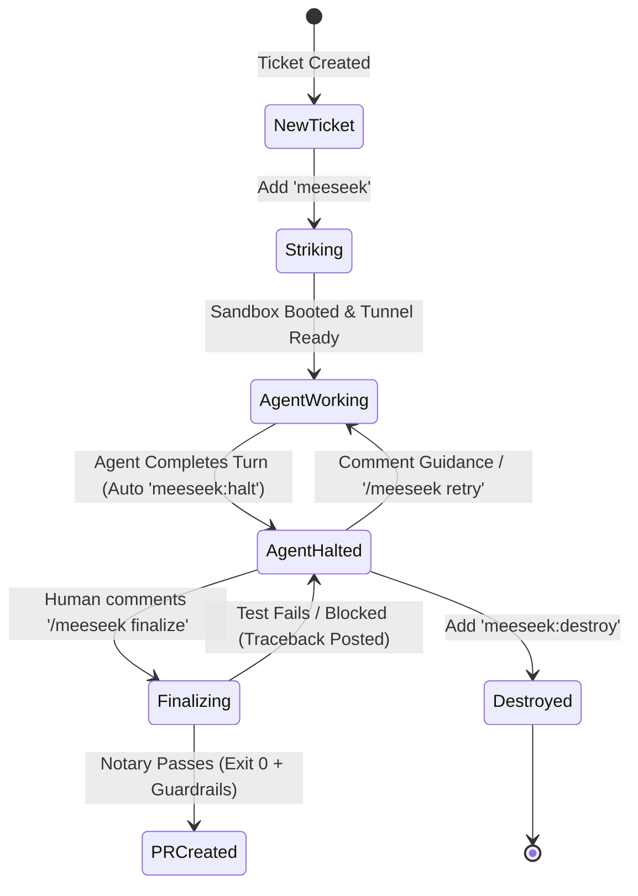
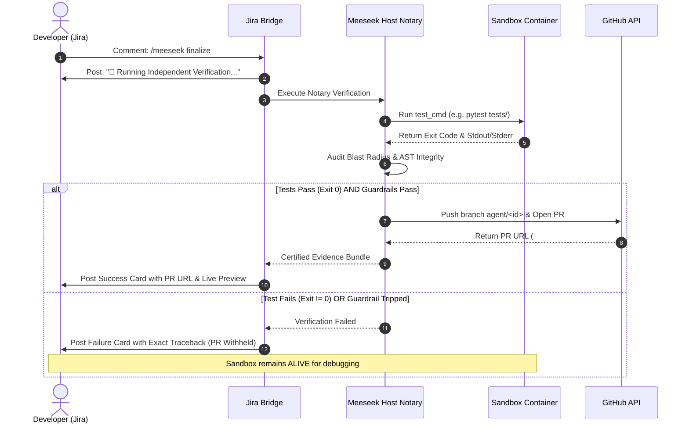

# Developer Guide: Jira Commands, Labels & Multi-Repo Workflows 📘

> *"I'm Mr. Meeseeks, look at me! Tell me what to build on Jira, and I'll spin up a sandbox, write the code, verify it, and hand you a Pull Request!"*

---

## 1. Executive Summary & Purpose

Meeseek is designed to meet software engineers where they already spend their workday: **Jira**. 

Rather than requiring engineers to context-switch into proprietary web consoles or run local scripts, Meeseek exposes a fully conversational, event-driven interface directly inside Jira tickets. Through simple labels, natural language replies, and slash commands, developers can:
- Claim tasks and trigger isolated Copy-on-Write (CoW) Docker environments.
- Guide the autonomous agent during coding turns.
- Enforce plan-first safety mandates (`/plan`) before any code is modified.
- Link and orchestrate multi-repository feature branches (`Base: api@feat-branch`).
- Request impartial **Host Notary** verification and automatic Pull Request generation.
- Safely destroy ephemeral sandboxes without leaving dangling cloud resources.

This document serves as the authoritative specification and user manual for interacting with Meeseek via Jira, and doubles as the reference copy for the Meeseek Developer Portal documentation UI.

---

## 2. Onboarding & Application Catalog Setup [TODO]

> [!NOTE]
> **Status: Planned Architecture & Setup Specification**  
> *Detailed step-by-step onboarding walkthroughs will be finalized alongside the Console Dashboard onboarding wizard.*

This section covers how engineering teams and repository owners register new applications into the Meeseek ecosystem.

### Key Onboarding Prerequisites:
- **Repository Registration**: Linking GitHub repositories and configuring default base branches (`main`/`master`).
- **Workspace Manifest Definition**: Authoring the bash manifest (`manifests/<app-name>.sh`) defining the docker compose environment, base images, and preview ports.
- **Authoritative Test Suites**: Specifying the strict Exit 0 Notary command (`HOLO_TEST_CMD_<repo>`) that verifies agent changes host-side.
- **Seed Fixtures & Database State**: Pre-baking database migrations and mock data into the golden snapshot so workspaces boot pre-seeded in under 300ms.

---

## 3. Jira Ticket Formatting & Prompt Engineering [TODO]

> [!NOTE]
> **Status: Specification & Best Practices Draft**  
> *Clear guidelines for authoring high-precision tickets that yield production-grade Pull Requests on the first turn.*

The quality and deterministic accuracy of the agent's work directly correlate with the clarity of the Jira ticket. This section establishes organizational conventions for filing Meeseek-ready tickets:

### 3.1 Essential Ticket Components:
1. **Target Repository (`Repo: <name>`)**: In multi-repo architectures, clearly state which sub-repository requires modification.
2. **Current vs. Expected Behavior**: Describe what is currently happening vs. what the system should do.
3. **Reproduction Steps / Test Paths**: Mention existing unit test files (`tests/test_orders.py`) or API endpoints (`/v1/checkout`) to ground the agent's context.
4. **Acceptance Criteria**: Provide concrete checkboxes for what constitutes a successful fix.
5. **Architectural Guardrails / Out of Scope**: Explicitly note files or APIs the agent must *not* touch.

---

## 4. Jira Labels Reference (Workspace Lifecycle)

Labels dictate the overarching lifecycle state of a ticket's ephemeral execution sandbox.



### Labels Specification

| Label | Originator | Type | Purpose & Behavior |
| :--- | :---: | :---: | :--- |
| **`meeseek`** | **Human** | Trigger | **Claims the ticket and strikes an isolated sandbox.**<br>• Allocates a dedicated preview port.<br>• Clones the baseline repository into an isolated container.<br>• Boots backend/frontend services and begins autonomous coding.<br>• Posts the live preview URL and SSH tunnel instructions to Jira. |
| **`meeseek:halt`** | **Meeseek (Bot)** | State Indicator | **Passive indicator that the agent is parked.**<br>• Automatically applied when the agent finishes its coding turn (`session_state == "idle"`).<br>• Signals to humans: *"My changes are in place; waiting for your review, guidance, or finalization."*<br>• Automatically removed the moment a human comments or finalizes. |
| **`meeseek:destroy`** | **Human** | Teardown | **Tears down the sandbox completely.**<br>• Terminates and prunes Docker compose containers and network bridges.<br>• Cleans up temporary filesystem checkouts and preview ports.<br>• Wipes the SQLite task session state so a fresh run can be started if needed.<br>• Automatically removes itself once teardown is certified. |
| **`meeseek:plan-only`** | **Human** | Safety Modifier | **Forbids the agent from editing code.**<br>• The agent inspects the repository and architectural context.<br>• Formulates a detailed implementation plan in Jira.<br>• Halts and requests human approval (`/meeseek approve`) before write tools are enabled. |

> [!NOTE]
> **Why `meeseek:destroy` instead of `reset`?**  
> "Reset" can be ambiguous (does it run `git reset`? Does it restart containers?). `meeseek:destroy` explicitly reflects the immutable ephemeral design: like a Meeseeks, when its purpose is fulfilled or abandoned, the sandbox **ceases to exist**.

---

## 5. Jira Comment & Command Reference

Any comment starting with `/meeseek` or `#meeseek` is evaluated as an explicit control-plane directive. Furthermore, **any plain comment posted on an active ticket is automatically routed to the agent as guidance.**

### Command Catalog

| Command Syntax | When to Use It | Action Performed |
| :--- | :--- | :--- |
| **`/meeseek finalize`** | When you are satisfied with the code or live preview | **Invokes the Host Notary Validator:**<br>1. Executes the authoritative test suite inside the container.<br>2. Verifies strict **Exit 0** and runs deterministic blast-radius guardrails.<br>3. If passed: Opens a GitHub PR, links it in Jira, and includes live preview credentials.<br>4. If failed: Blocks PR, posts full traceback to Jira, and leaves sandbox alive for debugging. |
| **`/meeseek approve`**<br>*(alias: `yes`, `/meeseek yes`)* | When the agent asks an elicitation question or presents a `/plan` | **Authorizes the Agent:**<br>Resolves pending approval, unlocks write tools (if in plan-only mode), and instructs the agent to execute code changes immediately. |
| **`/meeseek decline`**<br>*(alias: `no`, `/meeseek no`)* | When the agent's proposed plan or assumption is incorrect | **Rejects Current Proposal:**<br>Informs the agent that the proposed plan or answer was rejected, prompting it to formulate an alternative approach. |
| **`/meeseek retry <guidance>`**<br>*(alias: `/meeseek feedback <text>`)* | When a test failed or you want the agent to iterate | **In-Container Remediation:**<br>Wakes up the agent inside the active container with your specific instructions (*e.g., `/meeseek retry The login endpoint returns 401 on empty password. Add input validation.`*). |
| **`/meeseek destroy`**<br>*(alias: `/meeseek stop`, `/meeseek release`)* | When you want to discard the work and free resources | **Teardown Directive:**<br>Releases and destroys the workspace environment immediately from comments. |
| **Plain Text (No Prefix)** | Anytime during an active session | **Natural Guidance:**<br>Any regular reply on the Jira ticket (*e.g., "Make sure you also add a unit test for negative amounts"*) is transparently forwarded to the agent's context. |

---

## 6. Working with Multi-Repo & Cross-Repository Workspaces

Enterprise systems rarely consist of a single standalone repository. Meeseek provides native declarative syntax inside the Jira ticket description for multi-repository targeting, upstream branch chaining, and composite dependencies.

### 6.1 Targeting Specific Repositories (`Repo:`)

In composite applications (e.g. workspaces containing `web-frontend`, `auth-service`, and `core-api`), specify which repository the agent should modify:

```text
Summary: Update Stripe checkout webhook handler
Description:
Repo: billing-service

We need to support invoice.payment_succeeded events in the webhook router.
```

* **Behavior**: Meeseek sets the agent's default working directory directly inside `billing-service/` while leaving the sibling services (`web-frontend`, `core-api`) running live in the background for integrated local testing.

---

### 6.2 Upstream Branch Chaining (`Base:` and `Depends-On:`)

When building a feature that depends on another engineer's unmerged PR or a cross-repo service branch, use the `Base:` convention:

```text
Summary: Add Frontend UI for New Loyalty Points API
Description:
Repo: web-frontend
Base: core-api@feature/loyalty-points-v2

Render the new loyalty points badge on the user account settings page.
```

* **Behavior**:
  1. When striking the workspace, Meeseek checks out `feature/loyalty-points-v2` for `core-api`.
  2. Meeseek starts `core-api` on that branch so its live backend endpoints match the latest contract.
  3. The agent implements the frontend changes in `web-frontend`, testing end-to-end against the live branch.

---

## 7. Safety Mandates: Plan-Only Mode & Guardrails

To prevent unwanted code churn, hallucinations, or destructive modifications, Meeseek incorporates multi-tier defensive guardrails:

### 7.1 Plan-Only Mandate (`/plan`)
Include `/plan` in the ticket description or add the `meeseek:plan-only` label:

```text
Summary: Refactor Authentication Middleware
Description:
/plan

Evaluate moving our JWT validation from custom regex into python-jose.
Do not make code edits until we review the architectural impact.
```

1. **Safety Lock**: Agent write tools (`EditFile`, `WriteFile`, `Bash` modifying commands) are disabled.
2. **Analysis**: The agent reads the codebase, inspects dependencies, and formulates a step-by-step strategy.
3. **Review**: The agent posts the plan to Jira and halts.
4. **Execution**: The human reviews the plan and replies `/meeseek approve`. Meeseek removes the plan-only lock and unlocks full implementation mode.

### 7.2 Deterministic Blast-Radius Tripwires
During `/meeseek finalize`, Meeseek audits the final diff against safety limits:
* **LOC Budget**: Maximum 300 lines of modified code.
* **File Spread**: Maximum 4 modified files per ticket.
* **Sensitive Boundary Protection**: Modifying files matching `*auth*`, `*token*`, `*secret*`, or `*password*` requires manual override.
* **SQL Safety**: Statements containing `DROP TABLE`, `DROP COLUMN`, or `TRUNCATE` are blocked.
* **AST Test Deletion Guard**: Sneaky deletion of `assert` statements or `test_*` functions is intercepted via AST analysis and blocks PR creation.

---

## 8. The Notary Verification & PR Opening Flow



### Exit 0 Certification Guarantee
Meeseek enforces an absolute rule: **The actor that does the work never certifies it.**  
Even if an LLM agent claims *"All tests passed!"*, Meeseek independently executes the test suite host-side. Only an authentic `Exit 0` from the runtime environment allows the PR to open.

---

## 9. Hackathon Judge & Reviewer Interactive Playground (Zero-Setup E2E) 🎮

> *"Want to test Meeseek in under 60 seconds without configuring Docker, building images, or setting up API keys? Follow this quickstart!"*

To allow hackathon judges and evaluators to test Meeseek's autonomous execution substrate immediately, we have provisioned a live, pre-seeded Jira project with sample tickets.

### 9.1 How Judges Can Test Live in 3 Steps:

```
┌────────────────────────────────────────────────────────────────────────────────────────┐
│                              JUDGE TESTING WORKFLOW                                    │
└────────────────────────────────────────────────────────────────────────────────────────┘

  1. Log in to Jira      ──► 2. Pick a Pre-Seeded Ticket  ──► 3. Add 'meeseek' Label
     (Shared Evaluator Creds)   (Bug Fix / Feature / Plan)        (Watch Meeseek Work!)
                                                                         │
                                                                         ▼
                               4. Review Live Preview & PR ◄──  Reply '/meeseek finalize'
                                  (Click-test in Browser)       (Notary Certifies Exit 0)
```

1. **Log in to Jira**:
   - **URL**: `https://<hackathon-jira>.atlassian.net`
   - **Evaluator Account**: `judge@aibuildercup.io` *(or provided guest credentials)*.
2. **Select Any Pre-Seeded Sample Ticket**:
   - 🎯 **Sample A (Fast Bug Fix — `DEMO-101`)**: *"Fix rounding issue on discount codes in checkout API"*  
     *(Tests the autonomous coding loop, test runner, and instant Exit 0 PR creation).*
   - 🎨 **Sample B (Frontend Feature with Preview — `DEMO-102`)**: *"Add customer export to CSV button on admin dashboard"*  
     *(Tests the hot-reloaded reverse proxy preview URL — click the link to see the button live before approving).*
   - 🛡️ **Sample C (Plan-Only Safety Guard — `DEMO-103`)**: *"Refactor payment provider integration `/plan`"*  
     *(Tests plan formulation without touching code, waiting for `/meeseek approve`)*.
3. **Trigger Meeseek**:
   - Simply add the Jira label: **`meeseek`**.
   - Within 15 seconds, Meeseek claims the ticket, strikes the isolated workspace, and comments with the Live Preview URL.
4. **Inspect on the Console Dashboard**:
   - Open the **Meeseek Live Console Dashboard** (`https://console.<domain>/`).
   - Watch the interactive state machine DAG step through:
     `STRIKING` $\to$ `BOOTING` $\to$ `CODING` $\to$ `HALTED (Awaiting Finalize)`.
5. **Finalize**:
   - Reply `/meeseek finalize` on Jira.
   - Watch the Notary verify tests and post the clickable GitHub Pull Request link directly to the ticket!

---

## 10. Developer Best Practices & Troubleshooting FAQ

### Q1: The PR creation was blocked because a test failed. How do I fix it?
**Do not destroy the workspace!** The container is still running with all your code and database state.
1. Read the failure traceback posted directly in the Jira comment.
2. Reply with guidance:
   ```text
   /meeseek retry Fix the broken assertion in test_checkout.py by ensuring currency defaults to USD.
   ```
3. Once the agent updates the code, reply:
   ```text
   /meeseek finalize
   ```

---

### Q2: Can I access the workspace directly in my browser?
**Yes.** Every active ticket comment includes a **Live Preview** link:
- Formatted as `https://admin.<domain>.aibuildercup.io` or through dynamic reverse-proxy tunnels.
- You can test forms, login flows, and UI updates in real-time before finalizing the PR.

---

### Q3: How do I cleanly start over if I made a mistake?
Simply add the Jira label:
```text
meeseek:destroy
```
*(or reply `/meeseek destroy`)*.  
Meeseek will tear down the containers and wipe the ticket record. Once cleared, re-add the `meeseek` label to start fresh from golden state.

---

### Q4: Can I test my changes via SSH or terminal?
Yes. Every ticket start comment includes an SSH/Tunnel command:
```bash
docker compose -p ws-<ticket> exec backend bash
```
*(or via the Meeseek CLI `meeseek tunnel <ticket>`)*. You can inspect logs, check file systems, and run commands alongside the agent.
