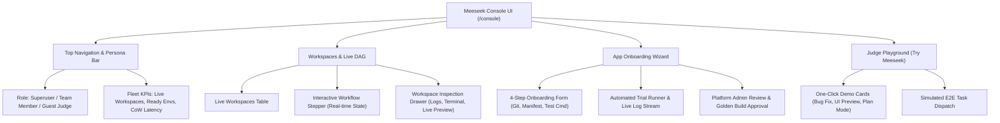

# Meeseek React Console UI: Architecture & Implementation Plan 🖥️

> *"I'm Mr. Meeseeks, look at me! Let's build a modern, high-polish, dark-mode developer console with real-time DAG steppers and zero deployment friction!"*

---

## 1. Executive Summary & Vision

Today, the Meeseek operator console is rendered as a monolithic, server-side Python string (`ops_console.py`) returning vanilla HTML, CSS, and basic JavaScript. While it served as a functional proof of concept, moving to a modern **React + Vite + Tailwind CSS** architecture provides:

1. **The Interactive Workflow State Machine (Visual DAG Stepper)**: Visualizing the ephemeral lifecycle (`CLAIMED` $\to$ `STRIKING` $\to$ `BOOTING` $\to$ `CODING` $\to$ `HALTED` $\to$ `NOTARY_CERTIFYING` $\to$ `PR_OPENED`) in real-time.
2. **Multi-Tenant Team Scoping & Minimal Auth**: Allowing teams to onboard their own apps, view team-scoped workspaces, and switch between Admin, Team Member, and Guest/Judge roles.
3. **Interactive Onboarding Wizard**: Replacing manual bash editing with a rich multi-step UI that tests repo connectivity, validates test commands via automated trial runs, and stages golden builds.
4. **Judge Interactive Playground**: A frictionless 1-click testbed for hackathon evaluators to witness the entire autonomous loop in under 60 seconds.

---

## 2. Zero-Friction Deployment Architecture (No Systemd Changes)

A common worry when introducing a frontend framework is infrastructure bloat: *Do we need a Node.js server? Do we need new systemd services? Will Caddy routing break?*

### The Answer: **Zero Deployment Changes**

We use the enterprise single-binary static-mount pattern:

```
┌────────────────────────────────────────────────────────────────────────────────────────┐
│                              SINGLE-PORT DEPLOYMENT                                    │
└────────────────────────────────────────────────────────────────────────────────────────┘

        Browser (Client)
               │
               ▼  HTTPS (443)
          Caddy Server
               │
               ▼  HTTP (Port 8000)
    ┌──────────────────────────────────────────────────────────────┐
    │                 FastAPI Control Plane (Uvicorn)              │
    │                                                              │
    │   • /api/*, /ops/state, /leases/*  ──► Python REST Endpoints │
    │   • /console, /static/*, /assets/* ──► StaticFiles ("dist/") │
    └──────────────────────────────────────────────────────────────┘
```

1. **Build Step**: The React app is compiled via `npm run build` into standard optimized HTML/JS/CSS bundles in `control-plane/ui/dist/`.
2. **Serving**: FastAPI mounts this directory:
   ```python
   app.mount("/console", StaticFiles(directory="ui/dist", html=True), name="console")
   ```
3. **Systemd Impact**: **NONE.** Systemd continues running `python -m uvicorn holodeck.api:app --port 8000`.
4. **Caddy Impact**: **NONE.** Caddy already routes `https://<ip>.sslip.io` to port 8000.
5. **Zero Downtime / Safe Parallel Dev**:
   - The existing `/ops` endpoint stays **100% untouched** while we build the React UI.
   - The new UI is accessible at `/console`.
   - Once the React UI is fully tested and verified, we simply point `/` and `/ops` to the React app!

---

## 3. UI Core Modules & Features



### Module A: The Interactive Workflow DAG & Stepper
* The centerpiece of the console.
* Displays a live horizontal state node stepper for any selected workspace:
  - 🔵 **CLAIMED**: Port reserved, ticket metadata ingested.
  - 🟣 **STRIKING**: Copy-on-Write cloning (<300ms) from golden snapshot.
  - 🟡 **BOOTING**: Docker compose services and healthchecks starting up.
  - 🟢 **CODING**: Autonomous AI agent executing tasks inside the container.
  - ⏸️ **HALTED (Awaiting Review)**: Agent finished turn; waiting for human decision or `/meeseek finalize`.
  - 🧪 **NOTARY VERIFYING**: Host Notary running `pytest` & AST guardrail checks.
  - 🚀 **PR OPENED**: Notary certified with Exit 0; GitHub PR live.
* Clicking any node reveals timestamp, execution latency, and relevant stdout logs.

### Module B: Multi-Tenant Team Scoping & Minimal Auth
* **Lightweight Role Switcher**:
  - **Platform Superuser**: Sees all workspaces, all teams, and pending onboarding reviews.
  - **Team Member (`Acme`, `Payments`)**: Scoped to just their team’s apps, workspaces, and team token.
  - **Guest / Judge**: Read-only observer mode with 1-click access to the demo playground.
* Uses the existing cookie and query parameter mechanism (`?team=slug&token=token`) so existing bookmarks and share links continue to work seamlessly.

### Module C: Workspace Fleet & Live Environment Management
* Real-time table of all active workspaces:
  - Ticket ID with direct link to Jira.
  - Target microservice / repository.
  - Status badge with live uptime timer.
  - **Live Preview Link**: Direct HTTPS button to click-test the application.
  - **GitHub PR Link**: Direct badge to the opened pull request.
  - **Action Menu**: `Destroy Workspace`, `Extend TTL (+30m)`, `Copy Tunnel Command`.

### Module D: Self-Serve App Onboarding & Platform Review
Migrates the existing `/ops/admin/onboarding` functionality into a slick multi-step wizard:
1. **Step 1: Application & Team Metadata**: Team name, application name, slack/email contact.
2. **Step 2: Microservice Repositories**: Git clone URLs, default branches, and dependency relationships.
3. **Step 3: Notary Verification Contract**: Defining the authoritative test command (`pytest tests/`, `npm test`) and exposed preview ports.
4. **Step 4: Automated Trial Run**: Runs a trial strike against the golden image builder, streaming logs into the browser to certify readiness before platform approval.

### Module E: Hackathon Judge Interactive Playground
* A dedicated tab for evaluators:
  - **"Try Demo 1: Autonomous Bug Fix"**: Dispatches a sample ticket, showing the agent fixing a broken test in under 45 seconds.
  - **"Try Demo 2: Full-Stack Feature with Live Preview"**: Dispatches a UI enhancement and opens the live preview URL.
  - **"Try Demo 3: Plan-Only Safety Mode"**: Dispatches an architectural refactor with `/plan` and waits for judge approval.

---

## 4. Implementation Phasing & Timeline

We can deliver this in 5 focused steps without disturbing the running systemd backend:

| Phase | Description | Deliverables | Est. Effort |
| :---: | :--- | :--- | :---: |
| **Phase 1** | **Frontend Scaffolding & Design System** | Scaffold Vite + React + TypeScript + Tailwind CSS inside `control-plane/ui`. Dark-mode layout, header, navigation, and API service client. | ~1 hr |
| **Phase 2** | **Workspaces Fleet & Interactive DAG Stepper** | Live workspaces table, real-time polling against `/ops/state`, and the visual state machine DAG stepper. | ~1.5 hrs |
| **Phase 3** | **Multi-Tenant Team Switcher & Minimal Auth** | Team switcher, role banner, guest mode, and cookie/token handling. | ~45 mins |
| **Phase 4** | **Onboarding Wizard & Platform Review** | 4-step app registration wizard, automated trial runner view, and admin review dashboard. | ~1.5 hrs |
| **Phase 5** | **Judge Playground & FastAPI Static Mount** | "Try in 60s" judge demo cards, FastAPI static file mounting at `/console`, and end-to-end testing on GCE VM. | ~1 hr |

---

## 5. Next Steps

1. Create the project directory structure under `control-plane/ui`.
2. Configure Tailwind CSS with the dark-mode Meeseek aesthetic (matching the dark `#0d1117` terminal theme).
3. Build the core components starting with the Live Workspace Fleet & Workflow DAG Stepper.

---

## 6. Backlog & Technical Debt (TODO)

- [ ] **Robust Agent Halt & Blocker Detection**: 
  Currently, agent pause/halt detection relies on matching heuristic string markers (`Your action:`, `What I need from you`, `Blocker.`) in `_check_halt()` when the session goes idle. This text-scanning approach is fragile if the model rephrases its hand-off or blocker message. Revisit to replace with structured machine-readable events or explicit tool schema elicitations (e.g. `request_human_guidance` or `mcp_elicitation`).

