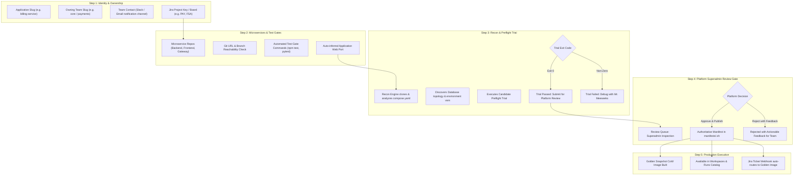
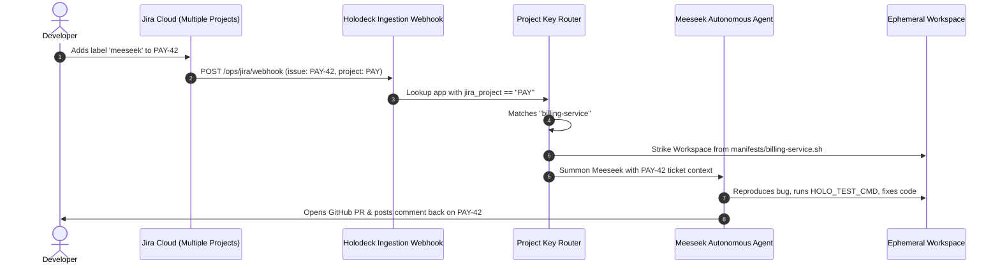

# Application Onboarding, Multi-Jira Integration & Golden Build Architecture

## Executive Summary

The **Application Onboarding Engine** transforms Meeseek from a single-app demonstration into a universal, enterprise-grade Autonomous Junior Engineer platform. Any engineering team can self-serve onboard their composite applications or microservices, specify automated test gates, verify container readiness with live preflight trials, and publish authoritative Golden Manifests for automated ticket-to-PR resolution.

---

## 1. End-to-End Onboarding Lifecycle



---

### Step 1: Application Identity & Team Ownership

This step establishes the operational and security perimeter for the application:

| Parameter | Type | Purpose & Architecture Rationale |
| :--- | :--- | :--- |
| **Application Slug** | String (required) | Unique identifier used for file naming (`manifests/<app_name>.sh`), Docker network namespaces, and Copy-on-Write (CoW) volume directories. |
| **Owning Team Slug** | String (required) | Multi-tenant RBAC boundary. Only members of this team and Superadmins can modify or view drafts for this application. |
| **Team Contact** | String (optional) | Slack channel (e.g. `#eng-billing`) or email. Used by Meeseek to ping the team upon opening PRs or when preflight reviews require human review. |
| **Jira Project Key** | String (optional) | The Jira project identifier (e.g., `PAY`, `FSA`, `CORE`). Links incoming Jira tickets directly to this application's environment. |

---

### Step 2: Microservices & Automated Test Gates

Composite modern systems often consist of multiple repositories (e.g., backend API, React frontend, reverse proxy). 

1. **Dynamic Microservice Rows**:
   - Supports unlimited repositories per composite application.
   - Roles: `primary` / `app`, `backend`, `frontend`, `gateway`, `worker`.
2. **Git Connectivity & Branch Reachability**:
   - Invokes `git ls-remote <url> <branch>` to confirm authentication (PAT token) and network connectivity before staging.
3. **Automated Test Gate Command (`HOLO_TEST_CMD`)**:
   - The team defines their automated test command (e.g. `npm test -- --watchAll=false`, `pytest tests/`, `mvn test`).
   - **Why this is critical**: The test gate is the regression contract. When Meeseek modifies code to fix a Jira ticket, it repeatedly runs this command inside the isolated ephemeral workspace. The agent will **never** open a GitHub Pull Request unless this test command passes with Exit Code 0.
4. **Auto-Inferred Web Port**:
   - Automatically inferred (Port `3000` if frontend present, `8000` for backend) or customized to route live preview tunnels.

---

### Step 3: Reconnaissance & Preflight Trial

When the team clicks **"Stage & Preflight Trial"**, Holodeck executes automated code reconnaissance and drafts the candidate manifest:

1. **Reconnaissance Engine (`recon.py`)**:
   - Clones checkouts to `/tmp/.../onboarding/<request_id>/<repo>`.
   - Inspects `docker-compose.yaml` / `compose.yaml` for database services (Postgres, Redis, MySQL).
   - Extracts environment variables and dependencies.
2. **Preflight Trial Execution (`trial.py`)**:
   - Compiles candidate manifest into a scratch throwaway directory (`/tmp/holodeck-onboarding-trials/trial-<app>-<random>/manifests/<app>.sh`).
   - Executes trial dry run:
     - Builds container images.
     - Verifies database migrations and seeds.
     - Runs HTTP readiness health check.
     - Executes registered automated test gate commands.
3. **Execution Modes**:
   - **Real Script Mode (`HOLODECK_TRIAL_RUNNER=script`)**: Executes real Docker and compose builds with full integration verification.
   - **Fast Mode (`HOLODECK_TRIAL_RUNNER=fake`)**: Synthetic verification stub used for fast unit tests without local Docker engines.
4. **Failure Resolution**:
   - If trial fails, stdout/stderr is streamed to the in-page terminal console.
   - The team can click **"Debug with Mr. Meeseeks"** to send the terminal failure log directly to the Gemini AI assistant for root cause analysis.

---

### Step 4: Submission & Platform Superadmin Review Gate

To prevent malicious manifests or unvetted scripts from publishing to the production fleet, Holodeck enforces an RBAC gate:

1. **Role Separation**:
   - **Engineering Teams**: Access the 3-step registration wizard and track real-time status of their team's applications.
   - **Platform Superadmins**: The registration wizard is hidden. Superadmins see the **Platform Onboarding Review Queue** at the top of the screen to inspect and certify pending requests.
2. **Superadmin Action: Approve & Publish**:
   - Invokes `POST /ops/admin/onboarding/requests/{id}/approve`.
   - Generates the authoritative production bash manifest directly in `control-plane/manifests/<app_name>.sh`.
   - Binds application to the team in `TeamStore`.
   - Promotes status to `published` (emerald green badge).
   - Triggers an atomic golden snapshot build.
3. **Superadmin Action: Reject with Feedback**:
   - Invokes `POST /ops/admin/onboarding/requests/{id}/reject`.
   - Superadmin enters actionable feedback (e.g., *"Please update test command to include linting, and specify web port 8080"*).
   - The request status is set to `rejected`, and the team immediately sees the feedback banner in their dashboard to adjust and re-stage.

---

## 2. Fast Mode vs. Real Script Mode: Analysis & Production Setup

### Why did the trial run in Fast Mode?
In `control-plane/holodeck/config.py`:
```python
trial_runner: str = field(default_factory=lambda: os.environ.get("HOLODECK_TRIAL_RUNNER", "fake"))
```
When `HOLODECK_TRIAL_RUNNER` is not set in `holodeck.env`, Holodeck defaults to `"fake"`. This mode exists so automated unit tests and CI pipelines without Docker-in-Docker can run cleanly without spinning up heavy containers.

### Why Real Script Mode is Essential
In production, running in Fast Mode means broken dependencies or invalid test commands will not be caught during preflight. 

When `HOLODECK_TRIAL_RUNNER=script` is configured:
1. `ScriptTrialRunner` creates a sandboxed scratch environment.
2. Points `HOLO_SRC` at the cloned repos and executes `golden-build.sh`.
3. Verifies that container layers build, database migrations run, and tests pass with Exit 0.
4. Teardown ensures no stale containers remain on the host.

### Enabling Real Mode on GCE:
In `/home/saif_dumps/meeseek/control-plane/holodeck.env`:
```bash
HOLODECK_TRIAL_RUNNER=script
```
Restart `meeseek` (`sudo systemctl restart meeseek`).

---

## 3. Multi-Jira Integration Architecture

### Current State
Today, Meeseek is configured with a global Jira instance:
- `JIRA_BASE_URL` (e.g. `https://your-org.atlassian.net`)
- `JIRA_API_TOKEN` & `JIRA_EMAIL`
- Single project scope (e.g. `FSA`)

### Multi-Project / Multi-Board Target Architecture



### Architectural Design:

1. **Jira Project Key Auto-Routing**:
   - Each onboarded app defines `jira_project` in Step 1 (e.g., `PAY`, `AUTH`, `FSA`).
   - When Jira sends a webhook (`jira:issue_updated`), Holodeck reads `data.issue.fields.project.key`.
   - Holodeck resolves the matching application manifest in `manifests/` whose `HOLO_JIRA_PROJECT` matches.
   - Holodeck strikes the ephemeral workspace using **that application's** golden image.

2. **Multi-Tenant Credentials (2 Supported Modes)**:
   - **Mode A: Single Organization / Multi-Board (Recommended for Hackathon)**:
     - The organization shares one Jira domain (`org.atlassian.net`) and one API service account.
     - Different teams only need to provide their **Project Key / Board** (e.g. `PAY`, `CORE`, `FSA`).
     - Zero secret friction for onboarding developers.
   - **Mode B: Multi-Organization / Custom Jira Instance**:
     - Optional URL and PAT override per application or team:
       - `jira_instance_url`: `https://payments-team.atlassian.net`
       - `jira_api_token`: Securely vaulted per team in `TeamStore`.

---

## 4. Workspaces Tab: Golden Image Selector Plan

### User Feedback & Rationale
Having a separate card grid at the bottom listing every golden build creates visual clutter as the catalog scales. Replacing it with an **Application Context Selector** at the top creates a cohesive multi-tenant workflow.

### Proposed UI & UX Architecture:

1. **Global Application Selector Dropdown**:
   - Located in the subheader or inside the **Golden Build Status Card**:
     `Application: [ Full-Stack App (FSA) ▼ ]`
   - Options populated dynamically from `state.environments` and published manifests:
     - `Full-Stack App (full-stack-application)`
     - `Billing Service (billing-service)`
     - `Payments Gateway (payments-gw)`
     - `All Applications` (Admin view)

2. **Reactive Panel Filtering**:
   - **Golden Build Status Card**:
     - Shows snapshot freshness, image tag, and CoW status for the selected app.
     - "Rebuild" button triggers rebuild for that specific selected application (`POST /ops/golden/rebuild?app=<selected>`).
   - **Workspaces & Active Strikes Table**:
     - Automatically filters the table to show only active leases running for the selected application.
   - **Strike Workspace Modal**:
     - Automatically pre-selects the dropdown app as default target.

