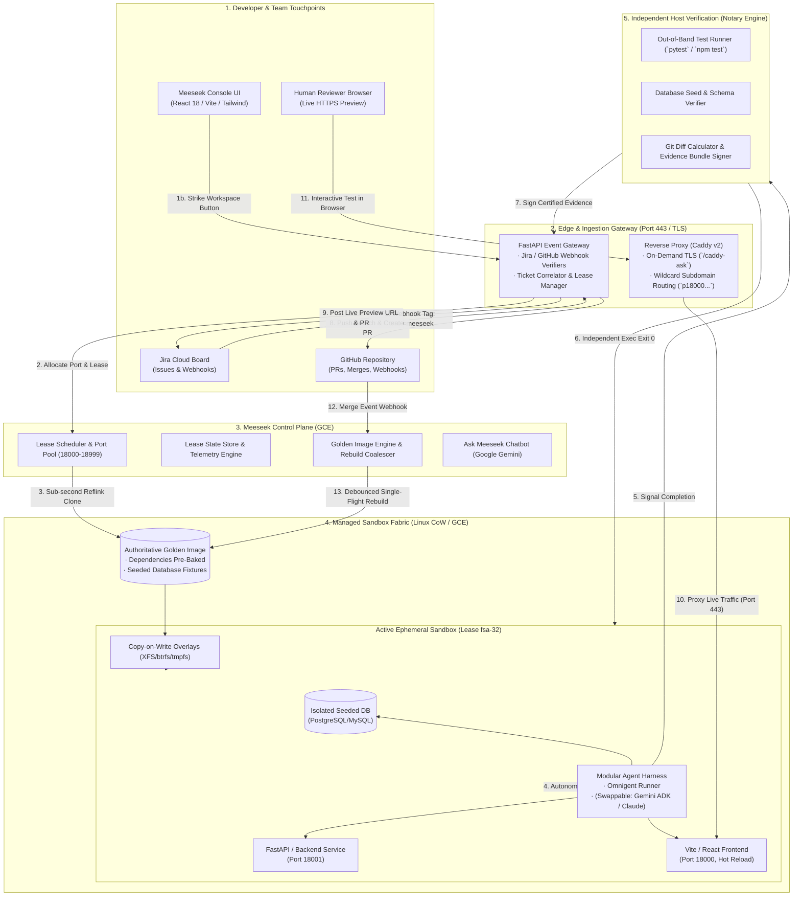

# High-Level Design (HLD): Meeseek System Architecture & Managed Sandbox Fabric

## 1. Executive Architecture Summary

**Meeseek** is an autonomous cloud-native software development platform that transforms issue tracker backlogs (Jira, GitHub Issues, Slack) into certified Pull Requests with interactive, live HTTPS preview environments in minutes.

Unlike existing AI code generators that run locally in IDEs or dump unverified code into repositories, Meeseek solves the **"last-mile" verification bottleneck** by providing:
1. **Sub-second Copy-on-Write (CoW) Sandboxes (< 2s strike)** from pre-baked Golden Images.
2. **A Managed Sandbox Fabric** wrapping autonomous coding agents (Omnigent / Claude / Gemini) in isolated Linux environments with dedicated port pools and seeded databases.
3. **Deterministic, Independent Host Verification (Notary)** executing regression test suites out-of-band (`Exit Code 0`).
4. **On-Demand HTTPS Live Previews** served on isolated subdomains via automated TLS reverse proxy routing without requiring human reviewers to pull code locally.
5. **Continuous Golden Build Synchronization** that keeps pre-warmed sandbox pools in sync with `main` via debounced, single-flight webhook builds.

---

## 2. End-to-End System Architecture Diagram (HLD)



---

## 3. Subsystem Breakdown & Deep-Dive Components

### 3.1. Edge Ingestion & Developer Touchpoints
* **Jira Cloud Webhook Ingestion:**  
  When an engineer adds the label `meeseek` or comments `@meeseek` on a Jira issue (e.g., `FSA-32`), Jira fires an issue-updated webhook to `POST /webhooks/jira`. The gateway parses the ticket summary, description, target repository, and security tokens.
* **Meeseek Developer Console (`http://localhost:5174/console/`):**  
  A modern single-page dashboard built with React 18, Vite, and Tailwind CSS. It connects to the control-plane REST and WebSocket APIs to display real-time cluster health, active leases, a 6-stage visual DAG stepper, and the **Ask Meeseek** Gemini drawer.
* **Reviewer Browser (Zero-Checkout Previews):**  
  Human reviewers do not need to pull code locally or run `docker compose up`. Instead, they click the live preview URL (e.g., `https://p18000.34.47.179.98.sslip.io`) and immediately interact with the working UI directly in their browser.

---

### 3.2. Control Plane (GCE)
Deployed as a centralized systemd service on Google Compute Engine, the Control Plane orchestrates all lifecycle states:
* **Lease Scheduler:** Maintains an atomic port pool (ports `18000` through `18999`). When a lease is requested, it claims a port block, mounts an isolated filesystem workspace, and attaches an ephemeral lease record.
* **State Store & Telemetry:** Tracks lease transitions through an authoritative state machine:
  $$\text{STRIKE} \longrightarrow \text{READY} \longrightarrow \text{AGENT} \longrightarrow \text{PREVIEW} \longrightarrow \text{NOTARY} \longrightarrow \text{PR\_DELIVERED}$$
* **TTL Guardian & Auto-Destruct:** Each lease has a configurable Time-To-Live (default 45 minutes). When the TTL expires or a PR is merged, the control plane triggers unmounting, terminates child processes, and releases ports, guaranteeing zero orphaned cloud spend.

---

### 3.3. Managed Sandbox Fabric (Innovation over Omnigent)

> **Architectural Key Point:**  
> The Omnigent agent runtime is purely an LLM prompt and tool-execution loop. **It does not natively possess container management, filesystem isolation, port binding, multi-tenant databases, or lifecycle orchestration.**  
> Meeseek builds the entire **Managed Sandbox Fabric** around Omnigent:

```
┌────────────────────────────────────────────────────────────────────────┐
│                      MEESEEK MANAGED SANDBOX WRAPPER                   │
│                                                                        │
│   ┌────────────────────────────────────────────────────────────────┐   │
│   │ Copy-on-Write (CoW) Filesystem Clone (< 300ms disk strike)     │   │
│   ├────────────────────────────────────────────────────────────────┤   │
│   │ Dedicated Port Allocation: FE: 18000 | BE: 18001 | DB: 18432   │   │
│   ├────────────────────────────────────────────────────────────────┤   │
│   │ Isolated Database Container with Pre-Seeded Golden Fixtures    │   │
│   ├────────────────────────────────────────────────────────────────┤   │
│   │ Live Hot-Reloading Services (Vite HMR + Uvicorn Auto-Reload)   │   │
│   ├────────────────────────────────────────────────────────────────┤   │
│   │ Process Supervisor & Isolation Boundary                        │   │
│   │                                                                │   │
│   │   ┌────────────────────────────────────────────────────────┐   │   │
│   │   │ PLUGGABLE AGENT HARNESS (Omnigent / Gemini / Claude)   │   │   │
│   │   │ · Code Exploration & AST Analysis                      │   │   │
│   │   │ · Live Unit Test Authoring                             │   │   │
│   │   │ · Targeted File Modifications                          │   │   │
│   │   └────────────────────────────────────────────────────────┘   │   │
│   │                                                                │   │
│   └────────────────────────────────────────────────────────────────┘   │
└────────────────────────────────────────────────────────────────────────┘
```

#### Why This Design Matters:
1. **Sub-Second Strike (< 2s total, < 300ms disk):**  
   Instead of running `docker build` or `npm install` for 15 minutes, Meeseek performs a filesystem reflink clone (using XFS/btrfs reflink or APFS snapshot) of the pre-warmed Golden Image.
2. **Pristine, Zero-Drift Sandbox Guarantee:**  
   Every task executes against a 100% fresh, isolated copy of the repository and seeded database. Dirty state from previous runs never contaminates future tasks.
3. **Pluggable & Swappable Agent Runtime:**  
   Because the sandbox fabric is decoupled from the agent logic, the underlying agent harness can be swapped from Omnigent to native **Google Gemini ADK** or **Anthropic Claude Code** without changing a single line of sandbox, networking, or notary code.

---

### 3.4. Independent Host Verification (Notary Engine)

> **Core Principle:**  
> *"The actor that does the work never certifies it."*  
> Modern LLMs are prone to hallucinated passes, false diff reports, or deleting tests to force pass rates. Meeseek enforces zero-trust verification from the host side.

When the agent signals completion, the control plane initiates the Host Notary:
1. **Out-of-Band Test Execution:**  
   The Notary executes the project's test command (`HOLO_TEST_CMD`, e.g., `pytest tests/`) from the host operating system, capturing the genuine process exit code. Only **Exit Code 0** is accepted.
2. **Database Seed & Schema Proof:**  
   The Notary executes read-only proof queries against the isolated tenant database to verify database fixtures survived and schema migrations succeeded.
3. **Git Diff Validation:**  
   The Notary inspects `git diff` against the golden base branch. Empty commits, unintended deletions, or suspicious credential leaks are blocked immediately.
4. **Automated Retry Budget:**  
   If host verification fails due to an agent error, Meeseek feeds the full terminal traceback back into the agent context with a bounded retry budget (default: 2 retries) before declaring failure.

---

### 3.5. Automated Golden Build Synchronization (Zero-Stale Code)

To prevent Golden Images from drifting out of date as teams merge PRs into `main`:
1. **GitHub Push Webhook:** Listens for push and merge events on `main` with HMAC signature validation.
2. **45-Second Debounce Quiet Window:** Rapid-fire merges (e.g. 4 PRs merged within 2 minutes) reset the timer, collapsing multiple commits into a single rebuild at the latest `HEAD`.
3. **Single-Flight Coalescer (`_dirty` flag):** If a new commit lands while a golden build is currently running, the manager sets `_dirty = True`. Upon completion, exactly one catch-up build runs. Maximum 1 concurrent build; zero CPU storms.
4. **Atomic Symlink Swaps:** Builds output to an isolated staging directory. Only if test gates and seed queries pass is the golden image atomically symlinked to the active slot. If a build fails, production sandboxes continue striking against the previous stable golden image without downtime.
5. **Warm Pool Drain & Refresh:** Stale pre-warmed idle pool slots are drained via `pool.drain()` and replenished with fresh slots booting off the updated golden image. Active running leases are preserved until their natural teardown.

---

### 3.6. Edge Routing & On-Demand TLS Reverse Proxy

* **Reverse Proxy on Port 443:**  
  Raw VM ports (18000–18999) are kept behind the firewall. All preview traffic routes through standard port 443 via Caddy.
* **On-Demand TLS with Abuse Protection (`/caddy-ask`):**  
  Caddy dynamically issues Let's Encrypt certificates on-the-fly for any valid preview subdomain (e.g. `p18000.34.47.179.98.sslip.io` or corporate `p18000.preview.mycorp.com`).
* **Abuse Guard:** Before requesting a certificate, Caddy calls the internal endpoint `GET /caddy-ask?domain=...`. If the port is not an active, allocated lease, the certificate request is instantly rejected, neutralizing certificate exhaustion attacks.
* **WebSocket & HMR Support:** The reverse proxy transparently supports Vite Hot Module Reloading (HMR) WebSockets and REST APIs with zero cross-origin (CORS) barriers.

---

### 3.7. Ask Meeseek Chatbot (Powered by Google Gemini)

* Integrated directly into the Developer Console and Onboarding Wizard.
* Powered by Google Gemini via the Gemini API / Vertex AI.
* **Telemetry Grounding:** The chatbot receives structured cluster telemetry:
  - Active and queued lease states
  - Recent Notary test run stdout/stderr logs
  - Golden image build status and cache timestamps
  - GitHub connection test results during repository onboarding
* **Capabilities:** Answers operational queries (*"Why did lease fsa-32 trigger a retry?"*), diagnoses test failures, explains code diffs, and assists administrators during multi-repo catalog configuration.

---

## 4. Multi-Tenant Application Catalog & Onboarding

Meeseek supports multi-application and multi-repo architectures through an isolated 3-step onboarding flow:
1. **Step 1 (App Identity):** Unique application key, display name, and project description.
2. **Step 2 (Repositories & Test Gates):** Git clone URLs, branch definitions, and test commands (`HOLO_TEST_CMD`). The built-in validator performs live git connection testing.
3. **Step 3 (Preflight & Superadmin Governance):** Runs an ephemeral preflight dry run to verify the golden image bakes cleanly. Upon completion, it enters the Superadmin Approval Queue where an administrator clicks **"Approve & Publish"** to enable the application across the enterprise.

---

## 5. Security & Isolation Model

| Dimension | Implementation |
| :--- | :--- |
| **Compute Sandbox** | Isolated Linux processes with memory/CPU limits running in disposable tmpfs/overlay filesystems. |
| **Network Boundaries** | Private Docker network per strike; container ports bound only to `127.0.0.1:<allocated_port>`; exposed externally only via reverse proxy port 443. |
| **Tamper-Proof Testing** | Agent processes run inside the sandbox; Notary test verification executes out-of-band directly from host supervisor. |
| **Data Cleanliness** | Workspaces are completely discarded upon lease completion. Zero disk leaks or cross-tenant data contamination. |
| **Secrets & Keys** | GitHub PATs and Jira credentials are restricted to the Control Plane environment; never mounted into agent-editable source directories. |
